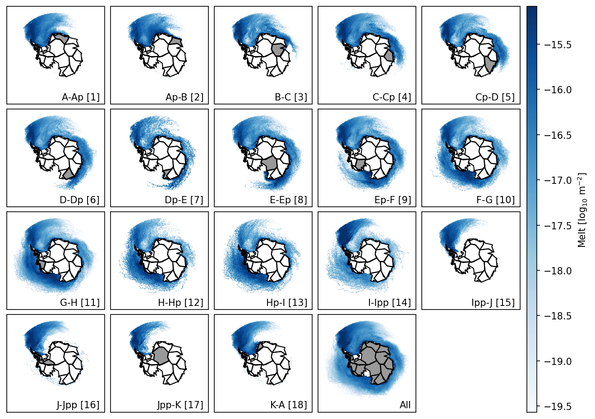

#+PROPERTY: header-args:jupyter-python+ :session fw-forcing-workshop

* Table of contents                               :toc_3:noexport:
- [[#introduction][Introduction]]
  - [[#data][Data]]
    - [[#printout][Printout]]
    - [[#information][Information]]
    - [[#figure][Figure]]
- [[#processing][Processing]]
  - [[#netcdf][NetCDF]]
    - [[#units-check][Units check]]

* Introduction

+ Data from Nico Jourdain processed from Mathiot (2023)
+ Rework to match other products generated for the Schmidt freshwater paper

** Data

*** Printout

#+BEGIN_SRC jupyter-python :exports results :prologue "import xarray as xr" :display text/plain
xr.open_dataset('./dat/AQ_iceberg_melt.nc')
#+END_SRC

#+RESULTS:
#+begin_example
<xarray.Dataset> Size: 450MB
Dimensions:              (region: 18, time: 12, latitude: 360, longitude: 720)
Coordinates:
  ,* longitude            (longitude) float64 6kB -179.8 -179.2 ... 179.2 179.8
  ,* latitude             (latitude) float64 3kB -89.75 -89.25 ... 89.25 89.75
  ,* region               (region) int32 72B 1 2 3 4 5 6 7 ... 13 14 15 16 17 18
  ,* time                 (time) int8 12B 1 2 3 4 5 6 7 8 9 10 11 12
    spatial_ref          int8 1B ...
Data variables:
    melt                 (region, time, latitude, longitude) float64 448MB ...
    msk_nemo             (latitude, longitude) float32 1MB ...
    region_name          (region) <U5 360B ...
    region_map           (latitude, longitude) int16 518kB ...
    region_map_expanded  (latitude, longitude) int16 518kB ...
Attributes: (12/19)
    description:           Annual JRA55 climatology
    original_data:         NEMO 0.25° simulations by Anna Olive-Abello (in pr...
    script_used:           remap_per_basin.py
    processed_by:          Nicolas Jourdain <nicolas.jourdain@univ-grenoble-a...
    geospatial_lat_min:    -89.75
    geospatial_lat_max:    89.75
    ...                    ...
    source:                doi:10.5281/ZENODO.8052519
    DOI:                   https://doi.org/10.5281/zenodo.14020895
    original_data_source:  Mathiot (2023) https://doi.org/10.5194/os-19-1595-...
    creator_name:          Ken Mankoff
    creator_email:         ken.mankoff@nasa.gov
    institution:           NASA GISS
#+end_example

*** Information

#+BEGIN_QUOTE
[!WARNING]
The highest melt rates (largest meltwater injection) occurs in near-coastal cells. If your model has land covering some of these cells, you may lose large melt inputs. Rescaling the melt so melt*area sums to 1 for your ocean is a good idea, but this also redistributes the largest melt points over the entire melt region. It may be better to re-scale the melt by increasing only the largest cell or largest few cells (which are hopefully nearby the coast and the high melt rate cells that were covered by land)
#+END_QUOTE

*** Figure

**** All regions annual map
#+begin_src jupyter-python :exports results :file ./fig/AQ_berg_melt_ann.png
import rioxarray as rio
import xarray as xr
import numpy as np
import cartopy.crs as ccrs
from cartopy.feature import ShapelyFeature
import matplotlib.pyplot as plt
import matplotlib.colors as mcolors
import geopandas as gpd
from tqdm import tqdm

gdf = gpd.read_file('~/data/IMBIE/Rignot/ANT_Basins_IMBIE2_v1.6.shp')
gdf['geometry'] = gdf['geometry'].simplify(100000)
gdf = gdf.set_index('Subregion').drop(columns='Regions')

ds = xr.open_dataset('dat/AQ_iceberg_melt.nc')
ds = ds.rio.write_crs('EPSG:3031')
ds = ds.sel({'latitude':slice(-90,-40)}, drop=True)

ds = ds.mean(dim='time')

llon,llat = np.meshgrid(ds['longitude'].values, ds['latitude'].values)
earth_rad = 6.371e6 # Earth radius in m
resdeg = 0.5 # output grid resolution in degrees
cell_area = np.cos(np.deg2rad(llat)) * earth_rad**2 * np.deg2rad(resdeg)**2
ds['area'] = (('latitude','longitude'), cell_area)
# ds['melt'] = ds['melt'] / ds['melt'].sum() # * ds['area']

proj = ccrs.Stereographic(central_latitude=-90, central_longitude=0)
gdf = gdf.to_crs(proj.proj4_init)

f, axs = plt.subplots(4,5,
                      figsize=((8.3/2.54)*3, 2.6*3), # w,h in inches
                      subplot_kw={"projection": proj})

# mmin = np.nanpercentile(ds['melt'].where(ds['melt'] != 0).values, 5)
# mmax = np.nanpercentile(ds['melt'].where(ds['melt'] != 0).values, 95)
roi_name = ds['region_name'].values

# Create a truncated colormap (exclude the lightest ~10% of 'Blues')
def truncate_colormap(cmap_in, minval=0.1, maxval=1.0, n=256):
    new_cmap = mcolors.LinearSegmentedColormap.from_list(
        f'trunc({cmap_in.name},{minval:.2f},{maxval:.2f})',
        cmap_in(np.linspace(minval, maxval, n))
    )
    return new_cmap
cmap = truncate_colormap(plt.get_cmap('Blues'), minval=0.1, maxval=1.0)# , n=bins)

for roi in tqdm(range(19)):
  ax = axs.flat[roi]

  ylabel = ''
  if (roi < 18):
    data = ds['melt'].isel({'region':roi})
    title = f"{roi_name[roi]} [{roi+1}]"
  elif (roi == 18):
    data = ds['melt'].mean(dim='region')
    title = 'All'
  else:
    assert(False)

  mmin = np.nanpercentile(data.where(data != 0).values, 5)
  mmax = np.nanpercentile(data.where(data != 0).values, 95)
  data = np.log10(data.where(data != 0))
  p = data.plot(ax=ax,
                add_colorbar = False,
                vmin = np.log10(mmin),
                vmax = np.log10(mmax),
                cmap = 'Blues',
                transform = ccrs.PlateCarree())
        
  # ax.coastlines()
  # ax.set_extent([-180.0,180.0,-90,-50], crs=ccrs.PlateCarree())
  # https://stackoverflow.com/questions/60908274/plotting-data-from-netcdf-with-cartopy-isnt-plotting-data-at-0-longitude
  lim=5000000; ax.set_xlim(-lim,lim); ax.set_ylim(-lim, lim)

  ax.set_title("")
  ax.text(0.95, 0.025, title,
          va='bottom', ha='right',
          transform=ax.transAxes, rotation_mode='anchor')
  
  fc='#999999'
  gdf.boundary.plot(ax=ax, color='k', linewidth=1)
  if roi < 18:
    geom = gdf.loc[roi_name[roi]]['geometry']
    ax.add_geometries(geom, crs=proj, facecolor=fc, edgecolor='k')
  if (roi == 18):
    gdf.plot(ax=ax, facecolor=fc, linewidth=1)

plt.subplots_adjust(hspace=0.05, wspace=0.05)    
_ = axs.flat[-1].axis('off')
cbar_ax = f.add_axes([0.91, 0.11, 0.015, 0.77])  # [left, bottom, width, height]
cb = plt.colorbar(p, cax=cbar_ax)
cb.set_label('Melt [log$_{10}$ m$^{-2}$]')
#+end_src

#+RESULTS:
:RESULTS:
: 100% 19/19 [00:12<00:00,  1.51it/s]

:END:

**** All regions monthly map
#+begin_src jupyter-python :exports results :file ./fig/AQ_berg_melt.png
import rioxarray as rio
import xarray as xr
import numpy as np
import cartopy.crs as ccrs
from cartopy.feature import ShapelyFeature
import matplotlib.pyplot as plt
import geopandas as gpd
from tqdm import tqdm

gdf = gpd.read_file('~/data/IMBIE/Rignot/ANT_Basins_IMBIE2_v1.6.shp')
gdf['geometry'] = gdf['geometry'].simplify(100000)
gdf = gdf.set_index('Subregion').drop(columns='Regions')

ds = xr.open_dataset('dat/AQ_iceberg_melt.nc')
ds = ds.rio.write_crs('EPSG:3031')
ds = ds.sel({'latitude':slice(-90,-40)}, drop=True)

llon,llat = np.meshgrid(ds['longitude'].values, ds['latitude'].values)
earth_rad = 6.371e6 # Earth radius in m
resdeg = 0.5 # output grid resolution in degrees
cell_area = np.cos(np.deg2rad(llat)) * earth_rad**2 * np.deg2rad(resdeg)**2
ds['area'] = (('latitude','longitude'), cell_area)
ds['melt'] = ds['melt'] / ds['melt'].sum() * ds['area']

proj = ccrs.Stereographic(central_latitude=-90, central_longitude=0)
gdf = gdf.to_crs(proj.proj4_init)

f, axs = plt.subplots(19, 13,
                      figsize=(19*3, 13*3),
                      subplot_kw={"projection": proj})

mmin = np.nanpercentile(ds['melt'].where(ds['melt'] != 0).values, 5)
mmax = np.nanpercentile(ds['melt'].where(ds['melt'] != 0).values, 95)
roi_name = ds['region_name'].values

for roi in tqdm(range(19)):
    for time in range(13):
        ax = axs[roi,time]

        title = ''
        ylabel = ''
        if (time < 12) and (roi < 18):
            data = ds['melt'].isel({'region':roi, 'time':time})
            if roi == 0:
                if time == 0: title = 'Month: '
                title = title + f"{time+1}"
            if time == 0: ylabel = f"{roi_name[roi]} [{roi+1}]"
        elif (time == 12) and (roi < 18):
            data = ds['melt'].mean(dim='time').isel({'region':roi})
            if roi == 0: title = f"Annual"
        elif (time < 12) and (roi == 18):
            data = ds['melt'].mean(dim='region').isel({'time':time})
            if time == 0: ylabel = 'All'
        elif (time == 12) and (roi == 18):
            data = ds['melt'].mean(dim=['region','time'])
        else: # should not be here
            assert(False)

        data = np.log10(data.where(data != 0))
        p = data.plot(ax=ax,
                      add_colorbar = False,
                      vmin = np.log10(mmin),
                      vmax = np.log10(mmax),
                      transform = ccrs.PlateCarree())
        
        ax.coastlines()
        ax.set_extent([-180,180,-90,-50], crs=ccrs.PlateCarree())

        ax.set_title(title)
        # ax.set_ylabel(ylabel)
        ax.text(-0.07, 0.55, ylabel, va='center', ha='center',
                rotation='vertical', rotation_mode='anchor',
                transform=ax.transAxes)

        gdf.boundary.plot(ax=ax, color='k', linewidth=1)
        if roi < 18:
            geom = gdf.loc[roi_name[roi]]['geometry']
            ax.add_geometries(geom, crs=proj, facecolor='k', edgecolor='k', alpha=0.33)
        if (roi == 18):
            gdf.plot(ax=ax, color='k', facecolor='k', linewidth=1, alpha=0.33)

        
plt.subplots_adjust(wspace=-0.935, hspace=0.1)
#+end_src

#+RESULTS:
:RESULTS:
: 100% 19/19 [29:50<00:00, 94.22s/it] 
[[./fig/AQ_berg_melt.png]]
:END:

* Processing

** NetCDF

#+begin_src jupyter-python :exports both :session Mathiot_2023
import rioxarray as rxr
import rasterio as rio
import xarray as xr
import numpy as np
import datetime

ds = xr.open_dataset('~/data/Mathiot_2023/iceberg_melt_pattern_SH_per_basin.nc')

# add projection metadata
ds = ds.rio.write_crs('epsg:4326') # create ds['spatial_ref']
ds = ds.rio.set_spatial_dims(x_dim='longitude', y_dim='latitude') # or ('lon','lat') and only maybe needed
ds['spatial_ref'] = ds['spatial_ref'].astype(np.byte)

# provide cell center values at all coordinates
ds = ds.pad(latitude=(0, 1), longitude=(0,1))  # Add one column at the end
ds['latitude'] = np.linspace(-89.75, 89.75, num=360)
ds['longitude'] = np.linspace(-179.75, 179.75, num=720)

ds['time'] = (('time'), np.arange(12).astype(np.int8)+1)

# Rignot basins are 1 through 18, not 0 through 17
# ds = ds.rename({'basin':'region'})
ds['region'] = (ds['region']).astype(np.int32)

ds['region_name'] = (('region'), ['A-Ap', 'Ap-B', 'B-C', 'C-Cp', 'Cp-D',
                                  'D-Dp', 'Dp-E', 'E-Ep', 'Ep-F', 'F-G',
                                  'G-H', 'H-Hp', 'Hp-I', 'I-Ipp', 'Ipp-J',
                                  'J-Jpp', 'Jpp-K', 'K-A'])

ds.attrs['description'] = 'Annual JRA55 climatology'

ds = ds.rename_vars({'melt_pattern':'melt'})
#                      'pattern_SH_allbasins':'melt_AQ'})

ds['melt'].attrs['units'] = 'm-2'
ds['melt'].attrs['grid_mapping'] = 'spatial_ref'
#ds['melt'].attrs['standard_name'] = 'water_flux_into_sea_water_from_icebergs'
ds['melt'].attrs['long_name'] = 'Normalised iceberg melt climatology per region of calving'
ds['melt'] = ds['melt'].transpose('region','time','latitude','longitude')

# normalize
llon,llat = np.meshgrid(ds['longitude'].values, ds['latitude'].values)
earth_rad = 6.371e6 # Earth radius in m
resdeg = 0.5 # output grid resolution in degrees
cell_area = np.cos(np.deg2rad(llat)) * earth_rad**2 * np.deg2rad(resdeg)**2
ds['area'] = (('latitude','longitude'), cell_area)
attrs = ds['melt'].attrs
ds['melt'] = (ds['melt']*ds['area']) / ((ds['melt']*ds['area']).sum()) / ds['area']
ds['melt'].attrs = attrs
ds = ds.drop_vars('area')

!cp ~/data/Mathiot_2023/regions*.tif ./tmp
rt = rio.open('./tmp/regions.tif').read(1)[::-1,:]
rt[rt < 0] = 0
ds['region_map'] = (('latitude','longitude'), rt)

rt = rio.open('./tmp/regions_expanded.tif').read(1)[::-1,:]
rt[rt < 0] = 0
ds['region_map_expanded'] = (('latitude','longitude'), rt)

ds['spatial_ref'].attrs['horizontal_datum_name'] = 'WGS 84'
ds['spatial_ref'].attrs['long_name'] = 'EPSG:3031'
ds['region'].attrs['long_name'] = 'Region IDs'
ds['time'].attrs['standard_name'] = 'time'
# ds['time'].attrs['units'] = 'months since 1999-12-01'
ds['longitude'].attrs['standard_name'] = 'longitude'
ds['longitude'].attrs['long_name'] = 'longitude'
ds['longitude'].attrs['axis'] = 'X'
ds['longitude'].attrs['units'] = 'degrees_east'
ds['latitude'].attrs['standard_name'] = 'latitude'
ds['latitude'].attrs['long_name'] = 'latitude'
ds['latitude'].attrs['axis'] = 'Y'
ds['latitude'].attrs['units'] = 'degrees_north'
ds['region_map'].attrs['long_name'] = 'IMBIE regions'
ds['region_map_expanded'].attrs['long_name'] = 'IMBIE regions'
ds['region_name'].attrs['long_name'] = 'IMBIE regions'
ds['region_name'].attrs['standard_name'] = 'region'

ds.attrs['geospatial_lat_min'] = ds['latitude'].values.min()
ds.attrs['geospatial_lat_max'] = ds['latitude'].values.max()
ds.attrs['geospatial_lon_min'] = ds['longitude'].values.min()
ds.attrs['geospatial_lon_max'] = ds['longitude'].values.max()

ds.attrs['Conventions'] = 'CF-1.8'
ds.attrs['date_created'] = datetime.datetime.now(datetime.timezone.utc).strftime("%Y%m%dT%H%M%SZ")
ds.attrs['title'] = 'Normalised iceberg melt climatology in the Southern Hemisphere per month and region of calving'
ds.attrs['history'] = 'See AQ_iceberg_melt.org'
ds.attrs['sourc_code_workbook'] = 'See AQ_iceberg_melt.org'
ds.attrs['source'] = 'doi:10.5281/ZENODO.8052519'
ds.attrs['DOI'] = 'https://doi.org/10.5281/zenodo.14020895'
ds.attrs['original_data_source'] =  'Mathiot (2023) https://doi.org/10.5194/os-19-1595-2023'
ds.attrs['creator_name'] = 'Ken Mankoff'
ds.attrs['creator_email'] = 'ken.mankoff@nasa.gov'
ds.attrs['institution'] = 'NASA GISS'

comp = dict(zlib=True, complevel=5)
encoding = {var: comp for var in ds.drop_vars(['region_name']).data_vars}
encoding['melt']['dtype'] = 'f4'

!rm ./dat/AQ_iceberg_melt.nc
ds.to_netcdf('./dat/AQ_iceberg_melt.nc', encoding=encoding)
!ncdump -h ./dat/AQ_iceberg_melt.nc
#+end_src

#+RESULTS:
#+begin_example
netcdf AQ_iceberg_melt {
dimensions:
	region = 18 ;
	time = 12 ;
	latitude = 360 ;
	longitude = 720 ;
variables:
	float melt(region, time, latitude, longitude) ;
		melt:_FillValue = NaNf ;
		melt:long_name = "Normalised iceberg melt climatology per region of calving" ;
		melt:comment = "The spatial integral on the spherical Earth summed over the 12 months and all regions is equal to 1.0" ;
		melt:units = "m-2" ;
		melt:grid_mapping = "spatial_ref" ;
		melt:coordinates = "spatial_ref" ;
	float msk_nemo(latitude, longitude) ;
		msk_nemo:_FillValue = NaNf ;
		msk_nemo:long_name = "Original land/sea mask in the NEMO simulation" ;
		msk_nemo:coordinates = "spatial_ref" ;
	string region_name(region) ;
		region_name:long_name = "IMBIE regions" ;
		region_name:standard_name = "region" ;
		region_name:coordinates = "spatial_ref" ;
	double longitude(longitude) ;
		longitude:_FillValue = NaN ;
		longitude:standard_name = "longitude" ;
		longitude:long_name = "longitude" ;
		longitude:axis = "X" ;
		longitude:units = "degrees_east" ;
	double latitude(latitude) ;
		latitude:_FillValue = NaN ;
		latitude:standard_name = "latitude" ;
		latitude:long_name = "latitude" ;
		latitude:axis = "Y" ;
		latitude:units = "degrees_north" ;
	int region(region) ;
		region:long_name = "Region IDs" ;
		region:comment = "IMBIE2 basin (https://doi.org/10.1038/s41586-018-0179-y)" ;
	byte time(time) ;
		time:standard_name = "time" ;
	byte spatial_ref ;
		spatial_ref:crs_wkt = "GEOGCS[\"WGS 84\",DATUM[\"WGS_1984\",SPHEROID[\"WGS 84\",6378137,298.257223563,AUTHORITY[\"EPSG\",\"7030\"]],AUTHORITY[\"EPSG\",\"6326\"]],PRIMEM[\"Greenwich\",0,AUTHORITY[\"EPSG\",\"8901\"]],UNIT[\"degree\",0.0174532925199433,AUTHORITY[\"EPSG\",\"9122\"]],AXIS[\"Latitude\",NORTH],AXIS[\"Longitude\",EAST],AUTHORITY[\"EPSG\",\"4326\"]]" ;
		spatial_ref:semi_major_axis = 6378137. ;
		spatial_ref:semi_minor_axis = 6356752.31424518 ;
		spatial_ref:inverse_flattening = 298.257223563 ;
		spatial_ref:reference_ellipsoid_name = "WGS 84" ;
		spatial_ref:longitude_of_prime_meridian = 0. ;
		spatial_ref:prime_meridian_name = "Greenwich" ;
		spatial_ref:geographic_crs_name = "WGS 84" ;
		spatial_ref:horizontal_datum_name = "WGS 84" ;
		spatial_ref:grid_mapping_name = "latitude_longitude" ;
		spatial_ref:spatial_ref = "GEOGCS[\"WGS 84\",DATUM[\"WGS_1984\",SPHEROID[\"WGS 84\",6378137,298.257223563,AUTHORITY[\"EPSG\",\"7030\"]],AUTHORITY[\"EPSG\",\"6326\"]],PRIMEM[\"Greenwich\",0,AUTHORITY[\"EPSG\",\"8901\"]],UNIT[\"degree\",0.0174532925199433,AUTHORITY[\"EPSG\",\"9122\"]],AXIS[\"Latitude\",NORTH],AXIS[\"Longitude\",EAST],AUTHORITY[\"EPSG\",\"4326\"]]" ;
		spatial_ref:long_name = "EPSG:3031" ;
	float region_map(latitude, longitude) ;
		region_map:_FillValue = NaNf ;
		region_map:long_name = "IMBIE regions" ;
		region_map:coordinates = "spatial_ref" ;
	float region_map_expanded(latitude, longitude) ;
		region_map_expanded:_FillValue = NaNf ;
		region_map_expanded:long_name = "IMBIE regions" ;
		region_map_expanded:coordinates = "spatial_ref" ;

// global attributes:
		:description = "Annual JRA55 climatology" ;
		string :original_data = "NEMO 0.25° simulations by Anna Olive-Abello (in preparation)" ;
		:script_used = "remap_per_basin.py" ;
		:processed_by = "Nicolas Jourdain <nicolas.jourdain@univ-grenoble-alpes.fr>" ;
		:geospatial_lat_min = -89.75 ;
		:geospatial_lat_max = 89.75 ;
		:geospatial_lon_min = -179.75 ;
		:geospatial_lon_max = 179.75 ;
		:Conventions = "CF-1.8" ;
		:date_created = "20260314T155416Z" ;
		:title = "Normalised iceberg melt climatology in the Southern Hemisphere per month and region of calving" ;
		:history = "See AQ_iceberg_melt.org" ;
		:sourc_code_workbook = "See AQ_iceberg_melt.org" ;
		:source = "doi:10.5281/ZENODO.8052519" ;
		:DOI = "https://doi.org/10.5281/zenodo.14020895" ;
		:original_data_source = "Mathiot (2023) https://doi.org/10.5194/os-19-1595-2023" ;
		:creator_name = "Ken Mankoff" ;
		:creator_email = "ken.mankoff@nasa.gov" ;
		:institution = "NASA GISS" ;
}
#+end_example
*** Units check

#+BEGIN_SRC jupyter-python :exports both
import xarray as xr
import numpy as np

ds = xr.open_dataset('dat/AQ_iceberg_melt.nc')

llon,llat = np.meshgrid(ds['longitude'].values, ds['latitude'].values)
earth_rad = 6.371e6 # Earth radius in m
resdeg = 0.5 # output grid resolution in degrees
cell_area = np.cos(np.deg2rad(llat)) * earth_rad**2 * np.deg2rad(resdeg)**2
ds['area'] = (('latitude','longitude'), cell_area)

print( 'melt', (ds['melt']*ds['area']).sum().values )

times = (ds['melt']*ds['area']).sum(dim=['latitude','longitude','region'])
print( 'melt times', times.values, times.sum().values)

rois = (ds['melt']*ds['area']).sum(dim=['latitude','longitude','time'])
print( 'melt rois', rois.values, rois.sum().values)
#+END_SRC

#+RESULTS:
: melt 0.9999999999999993
: melt times [0.21226412 0.21147542 0.13949372 0.0709175  0.03975621 0.03771434
:  0.02769643 0.02736059 0.02663772 0.03100297 0.05438782 0.12129316] 0.9999999999999988
: melt rois [0.05009098 0.02514823 0.04793241 0.06839564 0.08365384 0.06996806
:  0.0044494  0.04884848 0.09774639 0.0667643  0.12500442 0.01450325
:  0.01124228 0.03596932 0.01408166 0.15047677 0.04301055 0.04271403] 0.9999999999999989
